<picture>
  <source media="(prefers-color-scheme: dark)" srcset="./assets/banner-dark.svg">
  <source media="(prefers-color-scheme: light)" srcset="./assets/banner.svg">
  
</picture>

I run [NexSites](https://nexsites.org): I host and manage websites for clients on Linux servers I operate myself.

To keep it running I build internal operations tooling with Claude Code, the Claude Agent SDK, and custom MCP servers: agents that run ops tasks, watch services, and report back. I'm self-taught. I learned by building things and keeping them running.

I'm looking for a role in AI engineering, AI automation, agent tooling, or solutions engineering. Building with LLM agents and the infrastructure under them is already my day-to-day work.

Almost all of my code is client and business work in private repos, so there is little to pin here. If you want to see how I build, [email me](mailto:ethxnmolson@gmail.com) and I'll walk you through it.

### Stack

<table>
  <tr><td><strong>Infrastructure</strong></td><td>Linux; Docker Compose; Caddy reverse proxy; Cloudflare (DNS, Access, Turnstile); Postgres; SQLite; uptime monitoring</td></tr>
  <tr><td><strong>Agent&nbsp;tooling</strong></td><td>Claude Code, Claude Agent SDK, custom MCP servers</td></tr>
  <tr><td><strong>Apps</strong></td><td>TypeScript, React, Next.js, SolidJS on the web; Rust, Tauri, Electron on the desktop</td></tr>
  <tr><td><strong>Scripting</strong></td><td>PowerShell, Bash, Python; some Lua/Luau for Roblox</td></tr>
  <tr><td><strong>Contact</strong></td><td><a href="mailto:ethxnmolson@gmail.com">ethxnmolson@gmail.com</a> &middot; <a href="https://nexsites.org">nexsites.org</a> &middot; Dallas, TX</td></tr>
</table>
