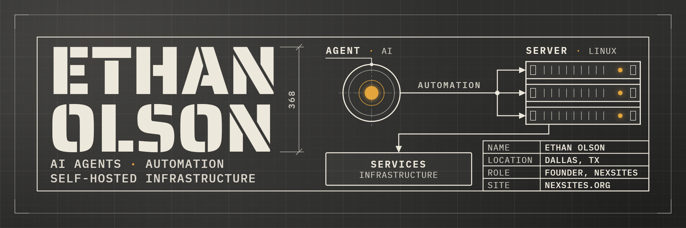

  

  <a href="https://nexsites.org">nexsites.org</a>&nbsp;&nbsp;·&nbsp;&nbsp;<a href="mailto:ethxnmolson@gmail.com">ethxnmolson@gmail.com</a>&nbsp;&nbsp;·&nbsp;&nbsp;Dallas, TX

## About

I run [NexSites](https://nexsites.org): I host and manage websites for clients on Linux servers I operate myself. To keep it running I build internal operations tooling with Claude Code, the Claude Agent SDK, and custom MCP servers: agents that run ops tasks, watch services, and report back. I'm self-taught. I learned by building things and keeping them running.

I'm looking for a role in AI engineering, AI automation, agent tooling, or solutions engineering. Building with LLM agents and the infrastructure under them is already my day-to-day work.

## Currently building

- **claude-devlog-loop** — a Claude Code plugin that closes the loop on agent sessions: state injected at session start, Stop-hook back-pressure when the devlog entry is missing, weekly roll-ups of flagged improvements. Extracted from four months of daily use; open-sourcing now.
- **agent-watchdogs** — next up: scheduled, tool-constrained Claude Agent SDK monitors that page when something is wrong, rebuilt from an internal tool.
- The infrastructure under all of it: Docker Compose, Caddy, Cloudflare, Postgres, on servers I run.

## Stack

  
  
  
  
  
  

  
  
  
  
  
  
  

  
  
  
  
  
  

## Activity

  

  

  <picture>
    <source media="(prefers-color-scheme: dark)" srcset="https://raw.githubusercontent.com/nexsites/nexsites/output/snake-dark.svg">
    <source media="(prefers-color-scheme: light)" srcset="https://raw.githubusercontent.com/nexsites/nexsites/output/snake-light.svg">
    
  </picture>

The snake is a custom generator in <a href="./scripts/snake.py">scripts/snake.py</a>: it paths to each contribution square, grows one segment per square, and starts over when the board is clear. Rebuilt nightly by a GitHub Action.

## Contact

<a href="mailto:ethxnmolson@gmail.com">ethxnmolson@gmail.com</a> · <a href="https://nexsites.org">nexsites.org</a> · Dallas, TX
